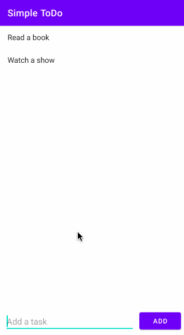

# Project 0 - *Simple ToDo*

**Simple ToDo** is an android app that allows building a todo list and basic todo items management functionality including adding new items, editing and deleting an existing item.

Submitted by: **Jesse Riley**

Time spent: **12** hours spent in total

## User Stories

The following **required** functionality is completed:

* [x] User can **view a list of todo items**
* [x] User can **successfully add and remove items** from the todo list
* [x] User's **list of items persisted** upon modification and and retrieved properly on app restart

The following **optional** features are implemented:

* [x] User can **tap a todo item in the list and bring up an edit screen for the todo item** and then have any changes to the text reflected in the todo list

The following **additional** features are implemented:

* [ ] User can understand app functionality better using **icons, styling, color, and spacing**
* [ ] User can **add a due date** for each todo item
* [ ] User can **select priority** of each todo item
* [ ] User can **sort todo items** by due date or priority

## Video Walkthrough

Here's a walkthrough of implemented user stories:

GIF created with [LiceCap](http://www.cockos.com/licecap/).

## Notes

Challenges encountered while building the app:

* I didn't realize at first that the onClickListener for items in the recycler view needs to be in TaskItemAdapter rather than just defined in MainActivity, but this helped me understand the purpose of the TaskItemAdapter better. I now understand that the TaskItemAdapter is specifically for anything that needs to access a particular item in the recycler view.
* Once I had switched from using startActivity() to using startActivityForResult() to open the editing feature, I had difficulty figuring out onActivityResult(). I didn't realize that onActivityResult() runs automatically once startActivityForResult() finishes, so I spent some time trying to figure out how to call onActivityResult() manually in my onClickListener definition. In particular, I thought it had to be called there so that I could acess the position of the item that was clicked in the recycler view. But I realized that I could just pass the position as an extra and let onActivityResult() run manually.
* When I clicked an item in the recycler view to try to edit it, nothing would visibly happen at first. This was because I was trying to set onSubmit() of the editing activity to call finish() when the update button was pressed, but I was doing this by passing the button as a View parameter to onSubmit(), and I wasn't doing anything with the View in the function. The solution I came up with was to set an onClickListener for the update button in onCreate() that would call onSubmit() within it.

## License

    Copyright [2021] [Jessica Riley]

    Licensed under the Apache License, Version 2.0 (the "License");
    you may not use this file except in compliance with the License.
    You may obtain a copy of the License at

        http://www.apache.org/licenses/LICENSE-2.0

    Unless required by applicable law or agreed to in writing, software
    distributed under the License is distributed on an "AS IS" BASIS,
    WITHOUT WARRANTIES OR CONDITIONS OF ANY KIND, either express or implied.
    See the License for the specific language governing permissions and
    limitations under the License.
